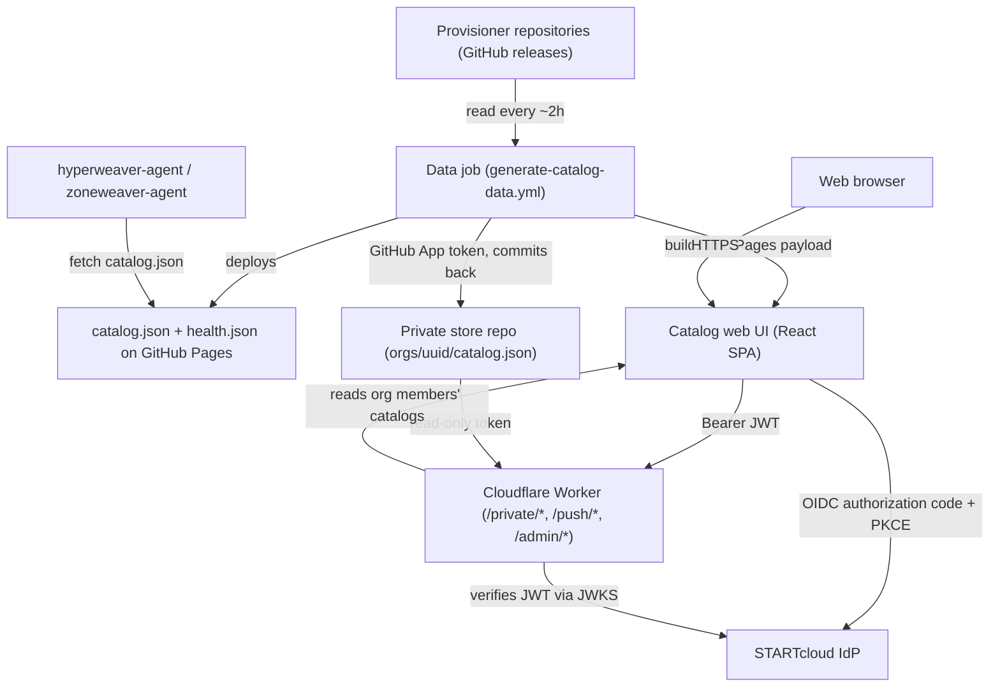

# STARTcloud Provisioner Catalog Documentation

{: .fs-9 }

The STARTcloud Provisioner Catalog is the public catalog of provisioner packages consumed by hyperweaver-agent and zoneweaver-agent to provision VMs and zones. Humans admit repositories, a scheduled data job publishes `catalog.json` from their GitHub releases, and authors own their releases. The same domain serves a browser UI and gates per-organization private catalogs behind OIDC.
{: .fs-6 .fw-300 }

[Get started now](#getting-started){: .btn .btn-primary .fs-5 .mb-4 .mb-md-0 .mr-2 }
[View API Reference](api/){: .btn .fs-5 .mb-4 .mb-md-0 }
[View on GitHub](https://github.com/STARTcloud/provisioner-catalog){: .btn .fs-5 .mb-4 .mb-md-0 }

---

## Getting started

Agents fetch exactly one document, `https://provisioner-catalog.startcloud.com/catalog.json`. It regenerates every ~2 hours from the admitted repositories' GitHub releases and serves metadata only: package archives are downloaded from each repository's own release assets and verified against the recorded sha256 checksum. The public path is static JSON plus GitHub Actions with no server in it.

### Key Features

- **Public catalog from admitted releases**: `sources.yml` is the admission list; the data job rebuilds `catalog.json` from each admitted repository's published releases and deploys it to GitHub Pages only when the data changed
- **One-line admission**: getting listed is one reviewed pull request adding a repository to `sources.yml`; `removed.yml` is the post-admission blacklist for malicious or broken repositories
- **Private per-organization catalogs**: a Cloudflare Worker on `/private/*` verifies the caller's Bearer JWT against the IdP's JWKS and serves `orgs/<org-uuid>/catalog.json` only to members of that organization
- **Immutability tripwire**: an already-published version whose asset hashes differently fails the build loudly; rebuilt artifacts must ship as a new version
- **Measured quality tiers**: `health.json` carries a machine-measured tier per family (Unrated, Bronze, Silver, Gold, Platinum, Diamond) recomputed on every data run and never author-declared; agents never read it
- **Notifications**: new versions dispatch Web Push events through the Worker, private-catalog releases post hub notifications through the IdP, and the web UI shows an inbox bell
- **Admin rebuild**: users with `ROLE_ADMIN` trigger the data job from the web UI through `/admin/rebuild` and poll its run status
- **Validation GitHub Action**: `uses: STARTcloud/provisioner-catalog@main` validates a repository's published releases against the artifact contract in the author's own CI, and `--tree` mode checks a working-tree manifest before a release exists

### Architecture

### Quick start

**Provisioner authors**

1. **Conform your releases**: publish `<name>-<version>.tar.gz` registry-shaped archives with a `.sha256` sidecar per asset, version sourced from `provisioner.yml` (the examples publisher kit has copy-paste workflows)
2. **Validate in your CI**: add `- uses: STARTcloud/provisioner-catalog@main` and get it green
3. **Open the admission PR**: add one line to `sources.yml` with the PR template's checklist completed
4. **Wait for the data run**: after merge, your packages appear in the published catalog within ~2 hours

**Consumers**

1. **Point an agent at the catalog**: `https://provisioner-catalog.startcloud.com/catalog.json` (agents accept multiple catalog URLs)
2. **Verify checksums**: agents verify the recorded sha256 after downloading an artifact
3. **Browse the web UI**: the same root serves a human view of the catalog, with sign-in for private organization catalogs

### Documentation

- **[API Reference](api/)** - The `catalog.json` and `health.json` contracts and the Worker routes
- **[Getting Started Guide](guides/getting-started/)** - First steps for authors and consumers
- **[Publishing a Provisioner](guides/publishing-a-provisioner/)** - The artifact contract and release workflows
- **[Provisioner CI/CD](guides/provisioner-ci/)** - The family CI/CD contract every provisioner repository follows
- **[Admission](guides/admission/)** - The `sources.yml` pull request and its checks
- **[Quality Tiers](guides/quality-tiers/)** - The measured tier ladder and its rules
- **[Private Catalogs](guides/private-catalogs/)** - Per-organization catalogs behind OIDC
- **[Notifications](guides/notifications/)** - Push and hub notifications for new versions
- **[Configuration](configuration/)** - Workflow secrets, Worker vars, and the web UI dev server

---

## About the project

The STARTcloud Provisioner Catalog is a STARTcloud project.

### License

The STARTcloud Provisioner Catalog is distributed under the [Apache License 2.0](https://github.com/STARTcloud/provisioner-catalog/blob/main/LICENSE.md).

### Contributing

When contributing to this repository, please first discuss the change you wish to make via issue, email, or any other method with the owners of this repository before making a change. Read more about becoming a contributor in [our GitHub repo](https://github.com/STARTcloud/provisioner-catalog/blob/main/CONTRIBUTING.md).

### Code of Conduct

The STARTcloud Provisioner Catalog is committed to fostering a welcoming community.

[View our Code of Conduct](https://github.com/STARTcloud/provisioner-catalog/tree/main/CODE_OF_CONDUCT.md) on our GitHub repository.
